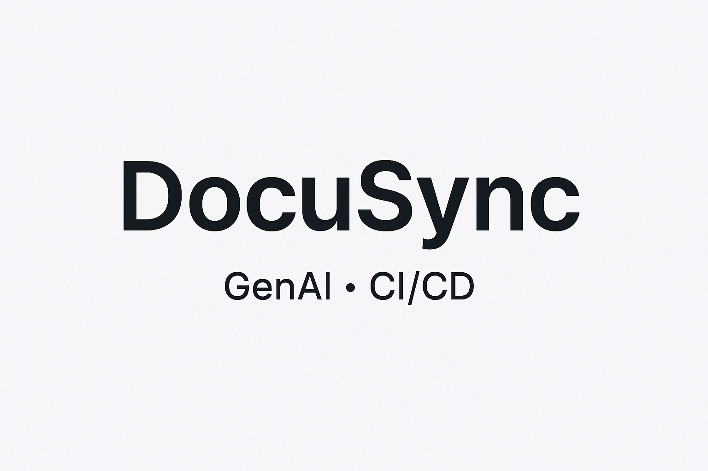

# DocuSync — LLM-Assisted Documentation
Automates product documentation from codebase & release metadata with an LLM + CI/CD.



## 1) Problem
Manual doc writing slowed releases and produced inconsistencies.

## 2) Approach
- Parse release metadata + code diffs
- Generate draft docs via LLM (OpenAI API)
- Human-in-the-loop review in PR
- CI/CD integration to trigger suggestions

## 3) Results
- **-70%** manual doc effort
- **2×** faster turnaround
- Better cross-team visibility

## 4) How to Run (local)
```bash
pip install -r requirements.txt
export OPENAI_API_KEY=...
python src/generate_docs.py --release_notes path/to/notes.md
```


